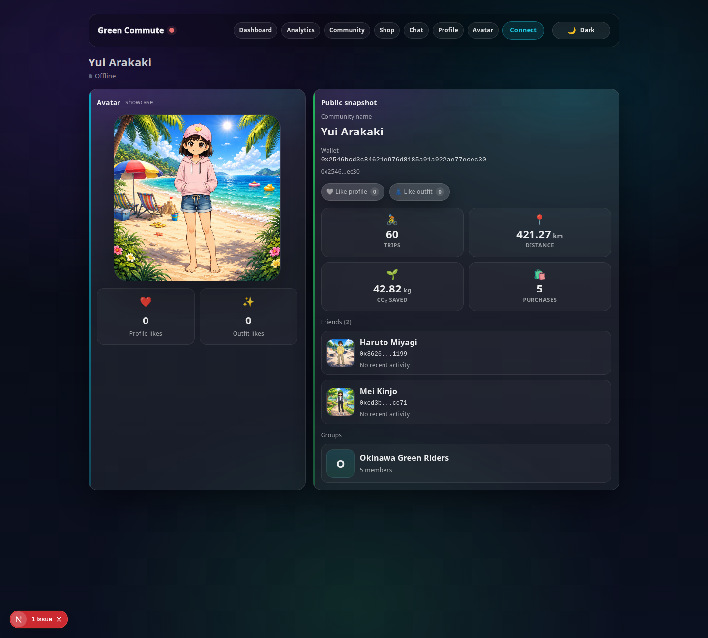
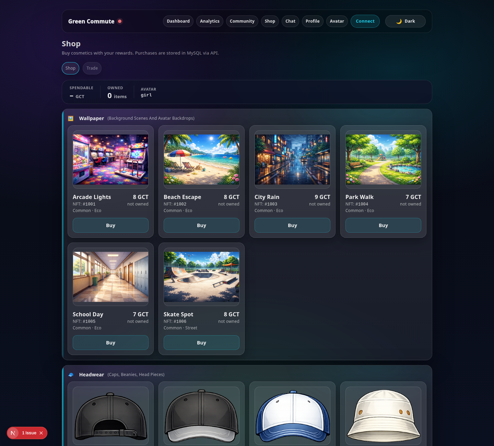
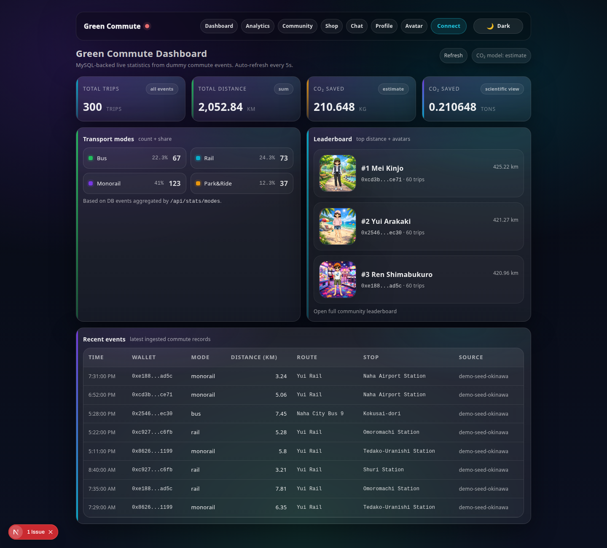
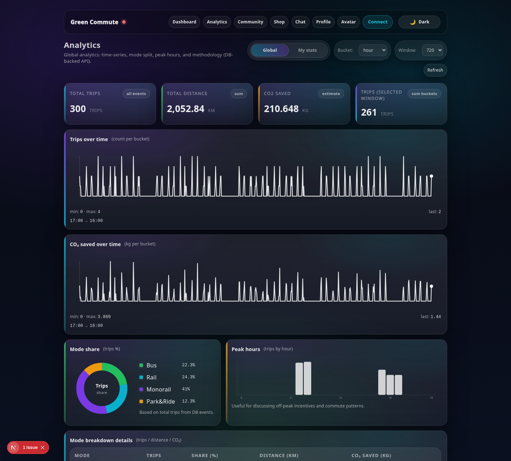
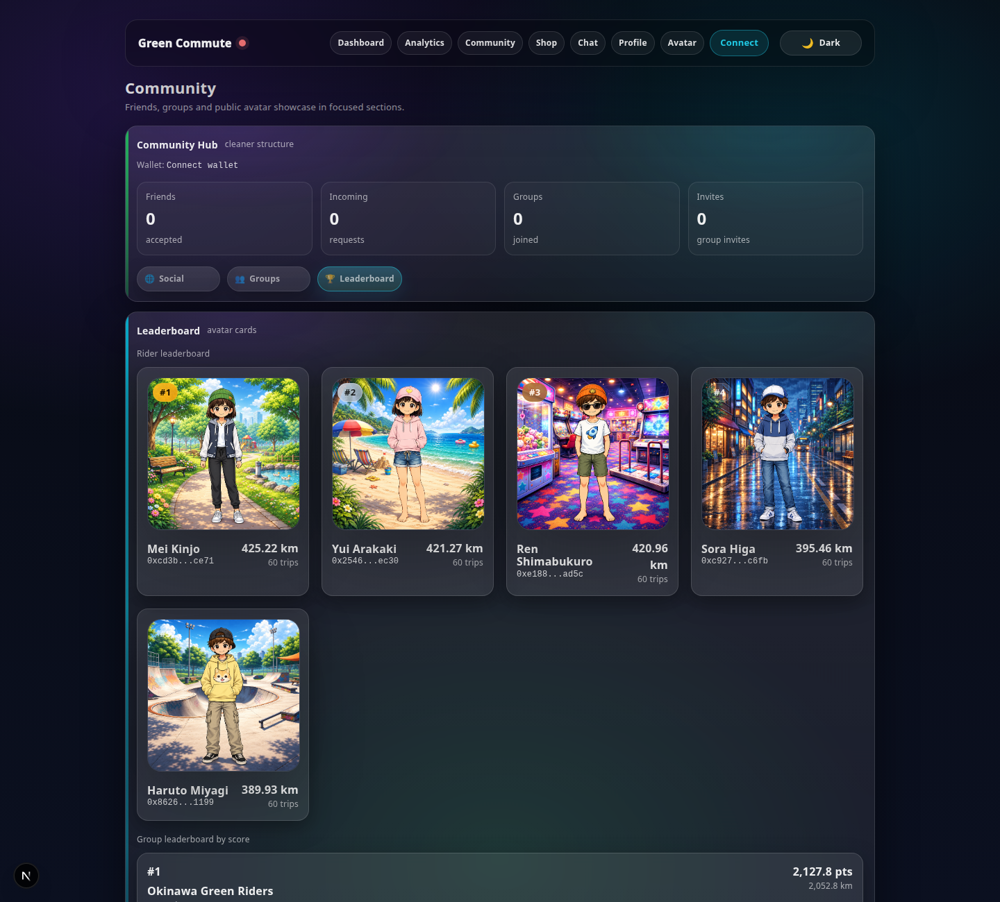

# sosmart Avatar Rewards

Earn blockchain rewards through sustainable commuting and redeem them for avatar cosmetics.

Travel events earn rewards that users claim as GCT tokens on chain. The in-app shop exchanges those tokens for ERC-1155 avatar clothing, accessories and backgrounds. Profiles, friends, group challenges and chat connect riders. Avatar upgrades change appearance, not character statistics.

## App preview

These screenshots retain the earlier **Green Commute** branding. Avatar appearance and clothing/accessory placement were refined with AI for this showcase and may differ from the current in-app rendering.

| Avatar profile | Token shop |
| --- | --- |
| [](screenshots/public-profile-yui-arakaki.png) | [](screenshots/shop.png) |

<details>
<summary>More screenshots: dashboard, analytics and community</summary>

| Dashboard | Analytics |
| --- | --- |
| [](screenshots/dashboard.png) | [](screenshots/analytics.png) |

**Community leaderboard**

[](screenshots/community-leaderboard.png)

</details>

## Repository structure

| Directory | Responsibility | Main technologies |
| --- | --- | --- |
| `web/` | App, shop, avatar editor, community and wallets | Next.js 16.1.6, React 19.2.3, Tailwind 4, wagmi, viem, TanStack Query, optional Alchemy Account Kit |
| `api/` | Travel events, rewards, SQL persistence, social features, chain verification | Node.js, Express 5, mysql2, Zod, ethers 6 |
| `contracts/` | ERC-20 rewards and ERC-1155 cosmetics | Solidity 0.8.24, Hardhat 2.26.3, OpenZeppelin 5.0.2, ethers 5 |
| `simulator/` | Optional synthetic journey control panel | Next.js and React |
| `tests/` | Browser integration test with real local MySQL and Hardhat | Node test runner, Playwright |

Each component has its own lockfile. Root npm scripts coordinate them without an npm workspace, keeping the ethers 5/6 dependency trees separate. The API and deployment script both read the catalog at `web/public/items/items.json`.

## First run

Prerequisites: Git, Node.js **24.21.0** (`.nvmrc` / `.node-version`), npm, and Docker Compose or an existing MySQL installation.

```bash
git clone git@github.com:tamaspflanzner/sosmart-avatar-rewards.git
cd sosmart-avatar-rewards
# If using nvm:
nvm install
npm ci
npm run install:all
cp api/.env.example api/.env
cp web/.env.local.example web/.env.local
cp simulator/.env.local.example simulator/.env.local
```

The web component includes its required npm peer-dependency setting in `web/.npmrc`. Keep all lockfiles; use `npm ci` for repeatable installs.

Start the local database:

```bash
docker compose up -d --wait db
```

This creates a MySQL 8.4 service bound to `127.0.0.1:3306`, initializes `green_commute` from `api/sql/init.sql`, and persists data in a named volume. The API example uses the matching local development password (`sosmart-local`). Schema initialization runs only for a new database volume. Stop the service with `docker compose stop db` when finished.

For an existing MySQL server, set the `DB_*` values in `api/.env` and import the schema yourself:

```bash
mysql -u root -p < api/sql/init.sql
```

Run these commands in separate terminals, from the repository root:

```bash
npm run dev:api        # http://localhost:4100
npm run dev:web        # http://localhost:3000
npm run dev:simulator  # http://localhost:3002 (optional)
```

The web dev script selects Webpack explicitly. The browser accesses the API through the web app's `/api-proxy` rewrite; `NEXT_PUBLIC_API_URL` controls its destination. Restart Next.js after changing its environment files. In the simulator, **Send once** creates one journey and **Start** generates journeys periodically.

```bash
curl http://localhost:4100/health
curl http://localhost:4100/api/stats/summary
```

`/health` checks the database and core events table; it returns HTTP 500 if unavailable. Statistics can be explored before configuring blockchain credentials.

## Local token claims and avatar purchases

The examples select Hardhat chain **31337**. Leave `NEXT_PUBLIC_AA_ENABLED=false` for a local injected wallet.

Start the chain and deploy both contracts from another terminal:

```bash
npm run chain
# In a second terminal:
npm run deploy:local
```

Update `api/.env` with:

- `GCT_CONTRACT_ADDRESS` and `COSMETICS_CONTRACT_ADDRESS`: the two deployment addresses.
- `GCT_CHAIN_ID=31337` and `COSMETICS_CHAIN_ID=31337`.
- `GCT_RPC_URL=http://127.0.0.1:8545`.
- `GCT_ORACLE_PRIVATE_KEY`: the first local Hardhat account's test private key (the default deployer/oracle).
- `COSMETICS_ADMIN_PRIVATE_KEY`: may remain empty to use the oracle key; the account must be an authorized minter.

Restart the API. Configure the browser wallet for RPC `http://127.0.0.1:8545`, chain ID `31337`, and ETH currency. Import a funded **local Hardhat test account**, then connect it in the app. Hardhat test keys are public demo credentials, never real funded-account keys.

The simulator generates events for its built-in demo addresses. To give your connected wallet rewards, send a journey for that address, replacing the placeholder below:

```bash
curl -X POST http://localhost:4100/api/events \
  -H 'Content-Type: application/json' \
  -d '{"walletAddress":"YOUR_0x_WALLET_ADDRESS","tripType":"bus","distanceKm":20,"source":"local-demo"}'
```

On **Profile**, create a claim and then choose **Claim on-chain**. On **Shop**, spend GCT on an item; check **Avatar** for the owned cosmetic. Restarting the ephemeral Hardhat node requires redeployment. Existing database claims and purchases are not automatically reset when the chain resets.

### Sepolia / embedded wallets

For Sepolia, set frontend `NEXT_PUBLIC_CHAIN_ID=11155111` and replace `NEXT_PUBLIC_RPC_URL` with a Sepolia RPC (or remove it to use the Alchemy-key/default Sepolia transport). Set matching backend chain IDs, RPC, contract addresses and signing keys. The frontend reads contract addresses from the API; the legacy `NEXT_PUBLIC_*_CONTRACT_ADDRESS` entries are not required.

Copy `contracts/.env.example` to `contracts/.env`, supply `SEPOLIA_RPC_URL` and `DEPLOYER_PRIVATE_KEY`, and run `npm --prefix contracts run deploy:sepolia` when intentionally deploying to that network. This spends the deployer's test ETH.

Embedded accounts are optional and require Sepolia plus `NEXT_PUBLIC_AA_ENABLED=true`, `NEXT_PUBLIC_ALCHEMY_API_KEY` and, for sponsored operations, `NEXT_PUBLIC_ALCHEMY_GAS_POLICY_ID`. Local Hardhat mode uses an injected wallet instead. Cloud sign-in and sponsorship require your own Alchemy configuration and are not covered by the local test suite.

## Validation

```bash
npm run lint              # Both frontends; warnings fail the check
npm test                  # API limit tests and contract tests
```

The database test user must be able to create and drop databases. Tests use unique `sosmart_test_*` / `sosmart_e2e_*` databases and clean them up. They do not load the developer API .env. For the provided Compose database:

```bash
DB_PASSWORD=sosmart-local npm run test:integration
npx playwright install chromium
DB_PASSWORD=sosmart-local npm run test:e2e
```

Set `DB_HOST`, `DB_PORT`, `DB_USER` and `DB_PASSWORD` explicitly for a different test server. The E2E test reserves ports **13000, 13002, 14100 and 18545**, deploys a local chain, builds and starts both production frontends, and runs Chromium with a synthetic injected wallet. It verifies:

- Seven public routes and the simulator's event button.
- Wallet connection, a 60 GCT claim and database confirmation.
- A token-funded shop purchase, ERC-1155 ownership and avatar inventory.
- No browser exceptions or failed proxied API calls during the flow.

Builds in the E2E test embed its isolated API/RPC URLs. Before running production manually, rebuild with your intended environment:

```bash
npm --prefix web run build
npm --prefix web start
# Simulator, if needed:
npm --prefix simulator run build
npm --prefix simulator start
```

GitHub Actions runs dependency installation, strict lint, unit/contract tests, MySQL 8.4 integration tests and the production browser flow on pushes to main and pull requests. Failure logs/screenshots are retained as workflow artifacts. No deployment or real network credentials are needed for CI.

## Project status and source

This remains a development/demo application. Demo event/admin endpoints and several wallet-address-based social operations are not authenticated; production deployment needs a separate authentication/authorization review. Local tests do not establish correctness of every social, trading or cloud-wallet path.

The old startup, MySQL LIMIT binding and lint failures have been corrected. Protocol identifiers (`GreenCommuteToken`, GCT, EIP-712 domain, cosmetic URIs), existing database naming and browser storage keys are retained for compatibility. User-facing branding and repository/package names use sosmart Avatar Rewards.

See [PROVENANCE.md](PROVENANCE.md) for the original source and licensing status. Historical documents are retained in `docs/legacy/`; use this README for current setup. Existing source-level author and license notices remain intact.
